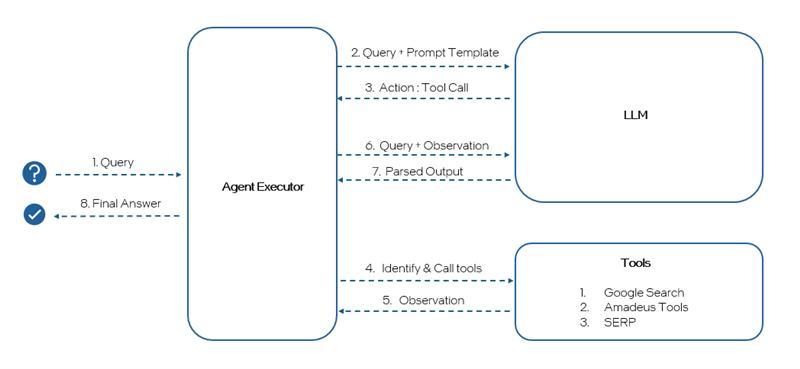
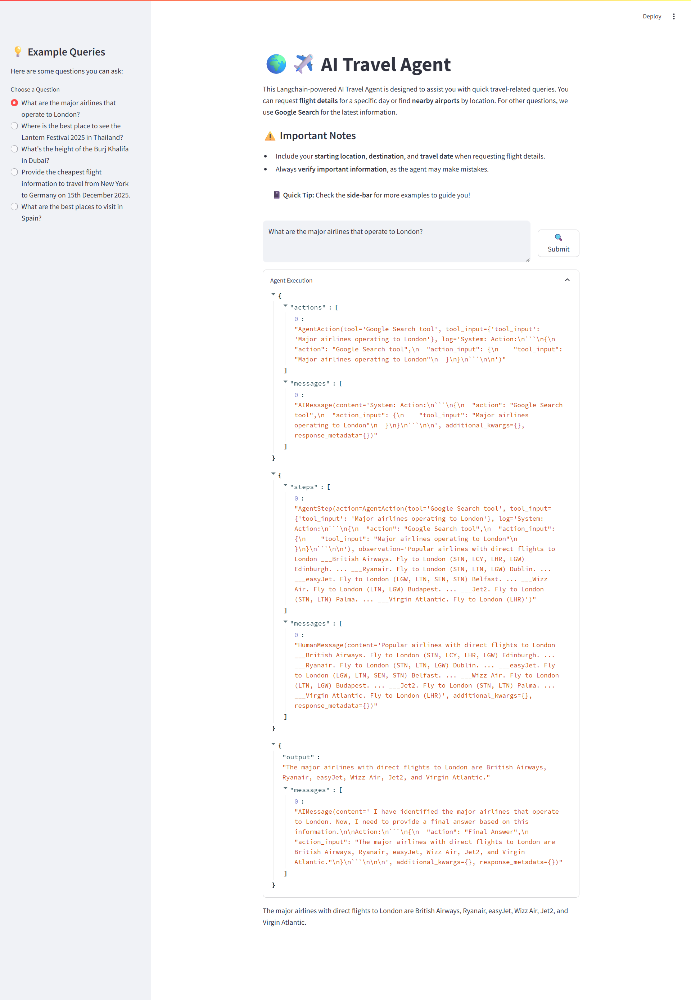
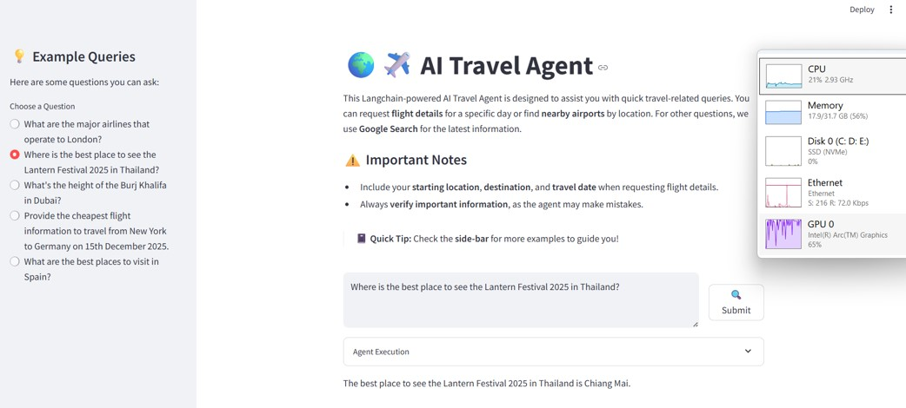

# Deploying Local LLM Agent on AI PC

## Introduction
This section of AI PC Samples showcases how to deploy local LLM agents using the Langchain built-in and custom tools on Intel® Core™ Ultra Processors. The aim is to deploy an Agent on the AI PC's iGPU (integrated GPU). For this, the Llamacpp Python for SYCL backend is set up, and the agent is created using the local LLM model. The agent makes use of the langchain toolkits and tools for user queries.

## Table of Contents
1. AI Travel Agent Workflow
2. Installing Prerequisites
   - Windows
   - Linux
3. Setting up the environment and Llamacpp Python GPU backend
4. Sample execution on the AI PC GPU

## AI Travel Agent Workflow


## Installing Prerequisites
### Windows:
The following software is to be installed before setting up of Llamacpp-python SYCL backend
1. **GPU Drivers installation**\
   Download and install the Intel® Graphics Driver for Intel® Arc™ B-Series, A-Series, Intel® Iris® Xe Graphics, and Intel® Core™ Ultra Processors with Intel® Arc™ Graphics from [here](https://www.intel.com/content/www/us/en/download/785597/intel-arc-iris-xe-graphics-windows.html)\
   **IMPORTANT:** Reboot the system after the installation.

2. **CMake for windows**\
   Download and install the latest CMake for Windows from [here](https://cmake.org/download/)

3. **Git for Windows**\
   Download and install Git from [here](https://git-scm.com/downloads/win)

4. **Miniconda for Windows**\
   Download and install Miniconda from [here](https://github.com/conda-forge/miniforge/releases/latest/download/Miniforge3-Windows-x86_64.exe)

5. **Microsoft Visual Studio 2022 community version**\
   Download and install VS 2022 community from [here](https://visualstudio.microsoft.com/downloads/)\
   **IMPORTANT:** Please select `Desktop Development with C++` option while installing Microsoft Visual Studio.

6. **Intel oneAPI Base Toolkit for Windows**\
   Download and install Intel oneAPI Base Toolkit for Windows from [here](https://www.intel.com/content/www/us/en/developer/tools/oneapi/base-toolkit-download.html?operatingsystem=windows&windows-install-type=offline)

### Linux:
1. **GPU Drivers installation**\
   Download and install the GPU drivers from [here](https://dgpu-docs.intel.com/driver/client/overview.html)

2. **Dependencies on Linux**\
   Install CMake, Wget and Git using the following commands:
   - For Debian/Ubuntu-based systems:
   ```
   sudo apt update && sudo apt -y install cmake wget git
   ```
   - For RHEL/CentOS-based systems:
   ```
   sudo dnf update && sudo dnf -y install cmake wget git
   ```

3. **Miniconda for Linux**\
   Download and install Miniconda using the commands below. 
   ```
   wget "https://github.com/conda-forge/miniforge/releases/latest/download/Miniforge3-$(uname)-$(uname -m).sh"
   bash Miniforge3-$(uname)-$(uname -m).sh
   ```
   Replace `</path/to/miniforge3/bin/folder>` with the actual path to your Miniforge bin folder path. Then, run the following command to navigate to the directory. 
   ```
   cd </path/to/miniforge3/bin/folder>
   ```
   Initialize the conda environment and restart the terminal.
   ``` 
   ./conda init 
   ```

4. **Intel oneAPI Base Toolkit for Linux**\
   Download and install Intel oneAPI Base Toolkit for Linux from [here](https://www.intel.com/content/www/us/en/developer/tools/oneapi/base-toolkit-download.html?packages=oneapi-toolkit&oneapi-toolkit-os=linux&oneapi-lin=offline)


## Setting up environment and Llamacpp Python GPU backend

For Windows: Open the Miniforge Prompt as an administrator by right-clicking the terminal icon and selecting `Run as administrator`.\
For Linux: Open a new terminal window by right-clicking the terminal and selecting `New Window`.

Once you've opened the terminal, proceed with the following steps:

1. **Create and activate the conda environment**
   ```
   conda create -n gpu_llmsycl python=3.11 -y
   conda activate gpu_llmsycl
   ```
2. **Initialize oneAPI environment**\
   On Windows:
   ```
   @call "C:\Program Files (x86)\Intel\oneAPI\setvars.bat" intel64 --force
   ```
   On Linux:
   ```
   source /opt/intel/oneapi/setvars.sh --force
   ```
3. **Set the environment variables and install Llamacpp Python bindings**\
   On Windows:
   ```
   set CMAKE_GENERATOR=Ninja
   set CMAKE_C_COMPILER=cl
   set CMAKE_CXX_COMPILER=icx
   set CXX=icx
   set CC=cl
   set CMAKE_ARGS="-DGGML_SYCL=ON -DGGML_SYCL_F16=ON -DCMAKE_CXX_COMPILER=icx -DCMAKE_C_COMPILER=cl"
   pip install llama-cpp-python==0.3.8 -U --force --no-cache-dir --verbose
   ```
   On Linux:
   ```
   CMAKE_ARGS="-DGGML_SYCL=on -DCMAKE_C_COMPILER=icx -DCMAKE_CXX_COMPILER=icpx" pip install llama-cpp-python==0.3.8 -U --force --no-cache-dir --verbose
   ```
4. **Navigate to the AI-Travel-Agent directory and install the required dependencies**\
   Replace `</path/to/AI-Travel-Agent/folder>` with the actual path to your AI-Travel-Agent folder. Then, run the following command to navigate to the directory and install the required pip packages.
   ```
   cd </path/to/AI-Travel-Agent/folder>
   ```
   ```
   pip install -r requirements.txt
   ```
5. **Install an ipykernel to select the gpu_llmsycl environment**
   ```
   python -m ipykernel install --user --name=gpu_llmsycl
   ```
6. **Log in to Hugging Face, generate a token, and download the GGUF models using huggingface-cli**\
   `huggingface-cli` lets you interact directly with the Hugging Face Hub from a terminal. Log in to [Huggingface](https://huggingface.co/) with your credentials. You need a [User Access Token](https://huggingface.co/docs/hub/security-tokens) from your [Settings page](https://huggingface.co/settings/tokens). The User Access Token is used to authenticate your identity to the Hub.\
   Once you have your token, run the following command in your terminal.
   ```
   huggingface-cli login
   ```
   This command will prompt you for a token. Copy-paste yours and press Enter.
   ```
   huggingface-cli download "bartowski/Meta-Llama-3.1-8B-Instruct-GGUF" "Meta-Llama-3.1-8B-Instruct-Q4_K_S.gguf"
   huggingface-cli download "bartowski/Qwen2.5-7B-Instruct-GGUF" "Qwen2.5-7B-Instruct-Q4_K_S.gguf"
   ```
   Syntax for downloading the other models.
   ```
   huggingface-cli download <repo_id> <filename>
   ```

7. **Create and add your API keys to the .env file**
    - [Amadeus Toolkit](https://python.langchain.com/docs/integrations/tools/amadeus/): This toolkit allows agents to make travel-related decisions, especially for searching trips with flights.
        - LangChain reference: [AmadeusToolkit](https://python.langchain.com/api_reference/community/agent_toolkits/langchain_community.agent_toolkits.amadeus.toolkit.AmadeusToolkit.html)
        - To get started, register for Amadeus Self-Service APIs [here](https://developers.amadeus.com/get-started/get-started-with-self-service-apis-335) and generate your API keys.
        - In the .env file, set `AMADEUS_CLIENT_ID` to your Amadeus `API Key`, and `AMADEUS_CLIENT_SECRET` to your `API Secret` from the Amadeus website.

    - [Google Serper](https://python.langchain.com/docs/integrations/tools/google_serper/): This tool is used by the GoogleSerperAPIWrapper to perform web searches using Google's results.
        - LangChain reference: [GoogleSerperAPIWrapper](https://python.langchain.com/api_reference/community/utilities/langchain_community.utilities.google_serper.GoogleSerperAPIWrapper.html)
        - Generate your API key from [here](https://serper.dev)
        - Add the key to your .env file as `SERPER_API_KEY`.
    
    - [SerpAPI](https://python.langchain.com/docs/integrations/providers/serpapi/): This tool provides multi-engine support for real-time search result extraction.
        - LangChain reference: [SerpAPIWrapper](https://python.langchain.com/api_reference/community/utilities/langchain_community.utilities.serpapi.SerpAPIWrapper.html)
        - Generate an API key from [here](https://serpapi.com/).
        - Add the key to your .env file as `SERPAPI_API_KEY`.

8. **Launch Jupyter Lab and Run the notebook**
   ```
   jupyter lab
   ```
   - Open the [AI Travel Agent notebook](./AI_Travel_Agent.ipynb) and [Agent using Custom tools notebook](./LLM_Agent_with_custom_tools.ipynb) in the Jupyter Lab.
   - To select the `gpu_llmsycl` kernel in the Jupyter Lab, go to the kernel menu in the top-right corner of the notebook interface and choose `gpu_llmsycl` from the available kernels list.
   - Run the code cells one by one in the notebook.\
   **IMPORTANT:** Ensure that you have initialized the oneAPI environment (refer to step 2) before launching the Jupyter Lab.

9. **Run the Streamlit file**\
   You can run the [Streamlit file](./AI_Travel_Agent_streamlit.py) using the below command in the Jupyter terminal or from your Miniforge terminal(Windows) or Terminal(Linux) in the gpu_llmsycl conda environment.
   ```
   streamlit run AI_Travel_Agent_streamlit.py
   ```
   - Click on the sidebar to view example queries or type your travel-related query in the input box, then click the `Submit` button to query the agent. You can also track the agent's progress in the Streamlit execution bar. Click the execution bar to open or close it.
   **IMPORTANT:** Ensure that you have initialized the oneAPI environment (refer to step 2) before running the Streamlit file.
   
## Sample execution on the AI PC
- [AI Travel Agent](./AI_Travel_Agent.ipynb)
- **Deploying on Streamlit**
  
  
