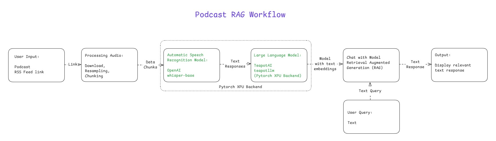
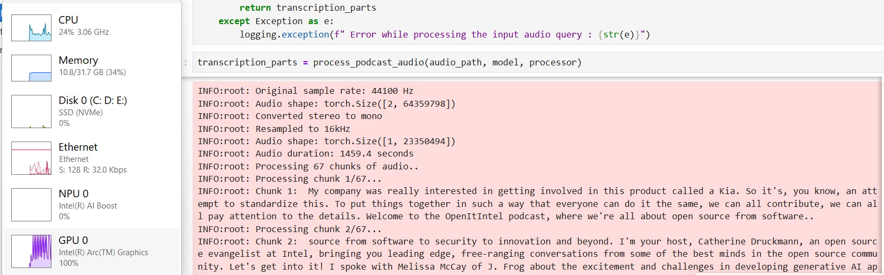
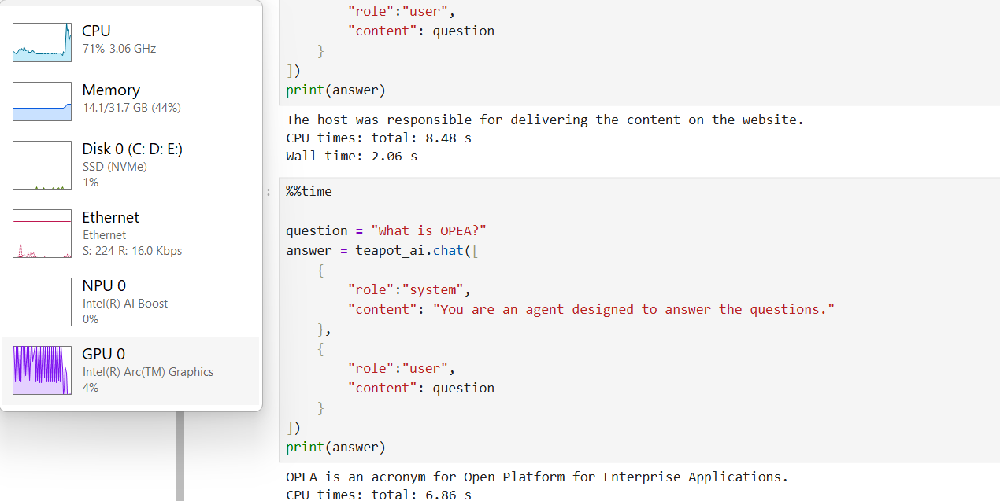

# Podcast RAG
## Introduction

This sample demonstrates a Retrieval-Augmented Generation (RAG) system using a **Podcast episode** as the knowledge base, with text query capability. 
Initially an RSS feed link will be the input to allow the user to select and download a specific podcast episode. The selected audio undergoes preprocessing steps such as resampling and chunking to prepare it for transcription. 
Each chunk is transcribed to text using the [**Whisper base model**](https://huggingface.co/openai/whisper-base) via an Automatic Speech Recognition (ASR) pipeline optimized to run on **Intel® Core™ Ultra Processors** with [**PyTorch XPU backend**](https://pytorch.org/docs/stable/notes/get_start_xpu.html) for hardware acceleration.  
These transcriptions are then embedded using [**Teapot LLM**](https://huggingface.co/teapotai/teapotllm), creating a knowledge base.
User queries are handled by the Teapot RAG system so that it retrieves a relevant text response. 

---

## Table of Contents

- [Architecture](#architecture)
- [Project Structure](#project-structure)
- [Prerequisites](#prerequisites)
- [Installing Prerequisites && Setting Up the Environment](#installing-prerequisites--setting-up-the-environment)
   - [For Windows](#for-windows)
   - [For Linux](#for-linux)
- [Running the Sample && execution output](#running-the-sample--execution-output)
- [Troubleshooting](#troubleshooting)
- [License](#license)

---

## Architecture

- User provides an `RSS feed URL` to list available podcast episodes.
- The selected audio podcast episode is downloaded, resampled and then split into chunks.
- Each chunk is transcribed to text using the [*Whisper base model*](https://huggingface.co/openai/whisper-base) (ASR).
- Transcribed text chunks are embedded using the [*Teapot LLM*](https://huggingface.co/teapotai/teapotllm) to create a searchable knowledge base.
- A text query from the user is processed by the Teapot LLM RAG system, to get a relevant text response.



---

## Project Structure

    PDF-to-Audio-RAG/                                                       # Project Sample folder
    ├── assets/                                                             # Assets folder which contains the images and diagrams
    │   ├── Query_rag_response.png                                          # Output screenshot image 2
    │   ├── Generating_podcast_audio_transcriptions_using_Pytorch_XPU.png   # Output screenshot image 1
    │   └── Pdf_to_audio_rag_workflow.png                                   # Workflow image
    ├── Podcast_RAG.ipynb                                                   # Notebook file to excute the project sample
    ├── Readme.md                                                           # Readme file which contains all the details and instructions about the project sample
    ├── pyproject.toml                                                      # Requirements for the project sample
    └── uv.lock                                                             # File which captures the packages installed for the project sample
   
---

## Prerequisites

|    Component   |   Recommended   |
|   ------   |   ------   |
|   Operating System(OS)   |   Windows 11 or later/ Ubuntu 20.04 or later   |
|   Random-access memory(RAM)   |   16 GB   |
|   Hardware   |   Intel® Core™ Ultra Processors, Intel Arc™ Graphics, Intel Graphics   |

---

## Installing Prerequisites && Setting Up the Environment

### For Windows:
To install any software using commands, Open the Command Prompt as an administrator by right-clicking the terminal icon and selecting `Run as administrator`.
1. **GPU Drivers installation**\
   Download and install the Intel® Graphics Driver for Intel® Arc™ B-Series, A-Series, Intel® Iris® Xe Graphics, and Intel® Core™ Ultra Processors with Intel® Arc™ Graphics from [here](https://www.intel.com/content/www/us/en/download/785597/intel-arc-iris-xe-graphics-windows.html)\
   **IMPORTANT:** Reboot the system after the installation.

2. **CMake for Windows**\
   Download and install the latest CMake for Windows from [here](https://cmake.org/download/)

3. **Git for Windows**\
   Download and install Git from [here](https://git-scm.com/downloads/win)

4. **uv for Windows**\
   Steps to install `uv` in the Command Prompt are as follows. Please refer to the [documentation](https://docs.astral.sh/uv/getting-started/installation/) for more information.
   ```
   powershell -ExecutionPolicy ByPass -c "irm https://astral.sh/uv/install.ps1 | iex"
   ```
   **NOTE:** Close and reopen the Command Prompt to recognize uv.
   
### For Linux:
To install any software using commands, Open a new terminal window by right-clicking the terminal and selecting `New Window`.
1. **GPU Drivers installation**\
   Download and install the GPU drivers from [here](https://dgpu-docs.intel.com/driver/client/overview.html)

2. **Dependencies on Linux**\
   Install CMake, Curl, Wget, Git using the following commands:
   - For Debian/Ubuntu-based systems:
   ```
   sudo apt update && sudo apt -y install cmake curl wget git
   ```
   - For RHEL/CentOS-based systems:
   ```
   sudo dnf update && sudo dnf -y install cmake curl wget git
   ```

3. **uv for Linux**\
   Steps to install uv are as follows. Please refer to the [documentation](https://docs.astral.sh/uv/getting-started/installation/) for more information.
   - If you want to use curl to download the script and execute it with sh:
   ```
   curl -LsSf https://astral.sh/uv/install.sh | sh
   ```
   - If you want to use wget to download the script and execute it with sh:
   ```
   wget -qO- https://astral.sh/uv/install.sh | sh
   ```
   **NOTE:** Close and reopen the Terminal to recognize uv.

---

## Running the Sample && execution output
   
1. In the Command Prompt/terminal, navigate to `Podcast-RAG` folder after cloning the sample:
   ```
   cd <path/to/Podcast-RAG/folder>
   ```
   
2. Sync the UV environment:\
   On Windows:
   ```
   set CMAKE_POLICY_VERSION_MINIMUM=3.5
   uv sync
   ```
   On Linux:
   ```
   uv sync
   ```
   
3. Log in to Hugging Face, generate a token, and download the required models and datasets:\
   `huggingface-cli` lets you interact directly with the Hugging Face Hub from a terminal. Log in to [Huggingface](https://huggingface.co/) with your credentials. You need a [User Access Token](https://huggingface.co/docs/hub/security-tokens) from your [Settings page](https://huggingface.co/settings/tokens). The User Access Token is used to authenticate your identity to the Hub.\
   Once you have your token, run the following command in your terminal.
   ```
   uv run huggingface-cli login
   ```
   This command will prompt you for a token. Copy-paste yours and press Enter.
   ```
   uv run huggingface-cli download openai/whisper-base
   uv run huggingface-cli download teapotai/teapotllm model.safetensors
   uv run huggingface-cli download teapotai/teapotembedding
   ```

4. Launch Jupyter Lab and Run the notebook:\
   Open the [Podcast-RAG](./Podcast_RAG.ipynb) notebook in the Jupyter Lab.
   - In the Jupyter Lab go to the kernel menu in the top-right corner of the notebook interface and choose default kernel i.e. `Python 3 (ipykernel)` from the available kernels list and run the code cells one by one in the notebook.
   ```
   uv run jupyter lab
   ```

5. GPU utilization can be seen in the Task Manager while generating audio transcriptions for input audio podcast which is processing on Intel XPUs.
   

6. Output response:
   
   
---

## Troubleshooting

- **Dependency Issues:** Run `uv clean` and then `uv sync`.
- **CMake compatibility issues:** Run `set CMAKE_POLICY_VERSION_MINIMUM=3.5` to prevent building issues.

---

## License

This project is licensed under the MIT License. See [LICENSE](../LICENSE) for details.
